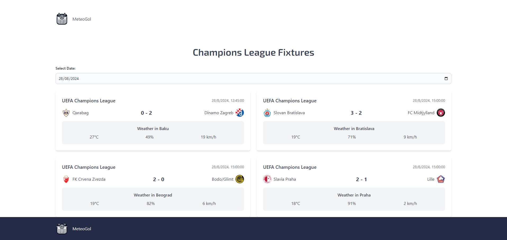

# Landing page made with Tailwind css and Vue js.

> ### Live URL: https://meteogol.netlify.app/

## Local Installation
- `` git clone https://github.com/fredygimenezsaha/meteogol.git ``
- `` cd /path/to/project ``
- `` npm install ``
- `` npm run dev ``

## Screenshot

